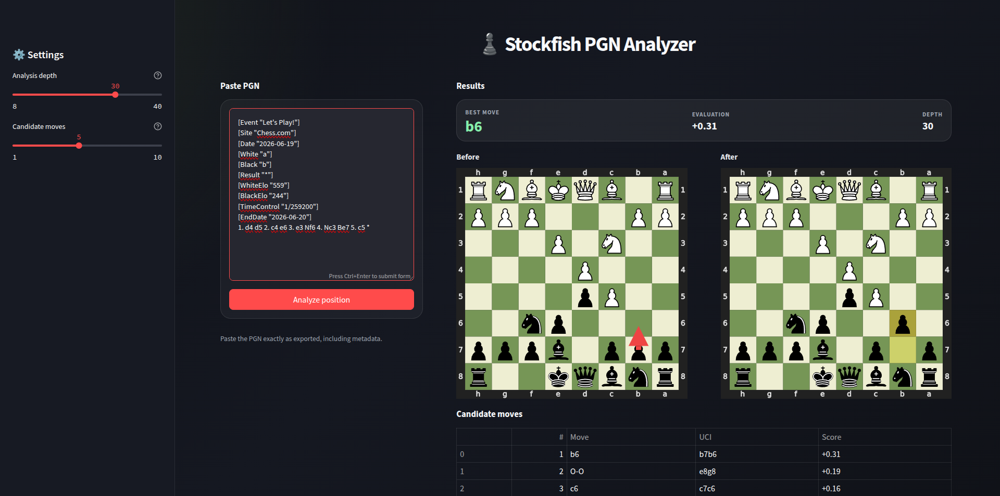

# Stockfish PGN Analyzer

A modern Streamlit app that analyzes a Chess.com PGN with Stockfish and displays the recommended move, candidate moves, and before/after boards.



## Features

- Paste a PGN directly from Chess.com
- Analyze the current position with Stockfish
- Display the best move and evaluation
- Show before/after chessboards
- Configure depth and number of candidate moves
- Docker-ready deployment

## Project structure

```text
.
├── app.py
├── Dockerfile
├── requirements.txt
├── .dockerignore
└── src
    ├── __init__.py
    ├── board.py
    ├── config.py
    ├── engine.py
    ├── pgn.py
    └── ui.py
```

## Local installation

Create and activate a virtual environment:

```bash
python3 -m venv .venv
source .venv/bin/activate
```

Install dependencies:

```bash
pip install -r requirements.txt
```

Install Stockfish locally:

```bash
sudo apt update
sudo apt install stockfish
```

Check the Stockfish path:

```bash
which stockfish
```

If needed, override the path:

```bash
export STOCKFISH_PATH=/usr/games/stockfish
```

Run the app:

```bash
streamlit run app.py
```

## Docker usage

Build the image:

```bash
docker build -t stockfish-pgn-analyzer .
```

Run the container:

```bash
docker run -p 8501:8501 stockfish-pgn-analyzer
```

Open:

```text
http://localhost:8501
```

## Deployment notes

The Docker image installs Stockfish inside the container. This means the analysis runs on the server/container, not on your local machine.

For platforms like Render, Railway, Fly.io, or a VPS, deploy the Dockerfile directly.

## Fair play notice

Use this app for training, study, and post-game analysis. Do not use engine assistance during live games against other players.
